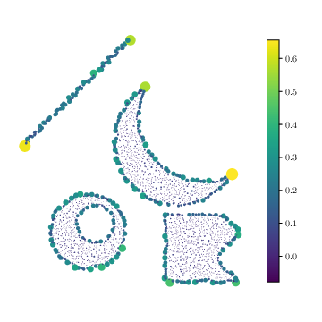
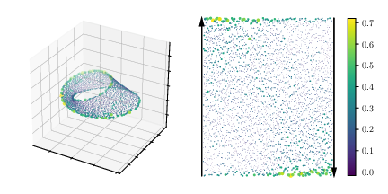

# metric-space-magnitude
Metric Space Magnitude: Code to demonstrate applications of the weighting vector for boundary detection and ML.

This work accepted as a spotlight presentation at [Topological Data Analysis and Beyond: Workshop at NeurIPS 2020](https://tda-in-ml.github.io/), submitted under the title **Weighting Vectors for Machine Learning: Numerical Harmonic Analysis Applied to Boundary Detection**, authors: Eric Bunch, Daniel Dickinson, Jeffery Kline, Glenn Fung. 

SlidesLive presentation for the workshop found [here](https://slideslive.com/38941573/weighting-vectors-for-machine-learning-numerical-harmonic-analysis-applied-to-boundary-detection). 

OpenReview submission [here](https://openreview.net/forum?id=AwBwKEzfaXG). 

Arxiv paper: [Practical applications of metric space magnitude and weighting vectors](https://arxiv.org/abs/2006.14063).

Before running experiments, please unzip files in `data` directory.

 
